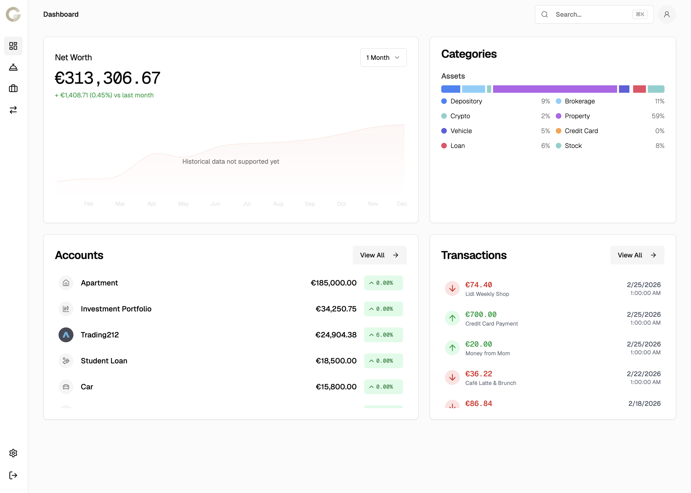

<p align="center">
  
</p>

<h1 align="center">Guilders</h1>

<p align="center">
  Open-source, self-hostable personal finance platform.<br/>
  Track everything — bank accounts, investments, crypto, property — in one place.
</p>

<p align="center">
  <a href="https://guilders.app">Website</a> ·
  <a href="https://dashboard.guilders.app">Dashboard</a> ·
  <a href="https://docs.guilders.app">Docs</a> ·
  <a href="https://api.guilders.app/openapi">API</a>
</p>

---

<p align="center">
  
</p>

## About

Guilders gives you a complete picture of your finances across every account you own. Connect your banks and brokerages automatically, or add manual accounts for cash, property, and anything else. An AI advisor helps you make sense of your data, and a fully open API means you stay in control — build your own integrations, connect your own AI agents, or push data from custom bank scrapers.

Use the hosted version at [guilders.app](https://guilders.app) or self-host the entire stack.

## Why Guilders?

The US has excellent personal finance tools — if you're stateside, you should probably use them. But if you're in Europe or another less-serviced market, your options are limited, fragmented, or locked behind services you can't inspect.

Guilders exists because:

- **Privacy through transparency** — Your financial data is sensitive. Guilders is fully open-source, so you can see exactly how your data is stored, processed, and never sold. Self-host it if you want complete control.
- **Europe and beyond** — Built with open banking providers that actually work outside the US, with native multi-currency support and automatic exchange rates. The hosted version at [guilders.app](https://guilders.app) absorbs the provider costs so you don't have to.
- **Net worth + budgeting in one place** — Most tools do one or the other. Guilders tracks your full net worth across every asset class _and_ gives you transaction categorization and spending insights.
- **Developer-first** — Open API, MCP support, and a pluggable provider system. If your bank isn't supported, build a scraper and push the data yourself.

## Features

- **Unified net worth** — Assets and liabilities across bank accounts, brokerages, crypto wallets, property, vehicles, credit cards, and loans
- **Automatic syncing** — Connect institutions via SaltEdge (open banking) and SnapTrade (brokerages), with more providers on the way
- **Manual accounts** — Track anything that doesn't have an API: cash, collectibles, real estate
- **Transaction tracking** — Categorize spending with hierarchical, customizable categories
- **Multi-currency** — Native support for any ISO currency with automatic exchange rate updates
- **AI financial advisor** — Chat with an AI that understands your full financial picture
- **MCP server** — Let your AI agents (Claude, Cursor, etc.) access your financial data via the Model Context Protocol
- **Open API** — Full REST API with OpenAPI docs, API key auth, and end-to-end type safety
- **Developer-friendly** — Build your own bank connections and push data to Guilders programmatically
- **Cross-platform** — Web dashboard, native mobile app (iOS & Android), and API access

## Architecture

```
┌──────────────┐    ┌──────────────┐    ┌──────────────┐
│   Dashboard  │    │  Mobile App  │    │  Your Tools  │
│   Next.js    │    │    Expo      │    │  API / MCP   │
└──────┬───────┘    └──────┬───────┘    └──────┬───────┘
       │                   │                   │
       └───────────────────┼───────────────────┘
                           │
                    ┌──────┴───────┐
                    │   Guilders   │
                    │     API      │
                    │   (Elysia)   │
                    └──────┬───────┘
                           │
              ┌────────────┼───────────┐
              │            │           │
        ┌─────┴──────┐  ┌──┴───┐ ┌─────┴─────┐
        │ PostgreSQL │  │  R2  │ │ Providers │
        │  (Neon)    │  │      │ │ SaltEdge, │
        │            │  │      │ │ SnapTrade │
        └────────────┘  └──────┘ └───────────┘
```

| App           | Stack                                                   | URL                      |
| ------------- | ------------------------------------------------------- | ------------------------ |
| **API**       | Elysia, Cloudflare Workers, Drizzle ORM, Better Auth    | `api.guilders.app`       |
| **Dashboard** | Next.js 16, React 19, Tailwind CSS, shadcn/ui, Recharts | `dashboard.guilders.app` |
| **Mobile**    | Expo 55, React Native, Expo Router                      | App Store / Play Store   |
| **Docs**      | Fumadocs, OpenAPI integration                           | `docs.guilders.app`      |

## Getting Started

### Prerequisites

- [Bun](https://bun.sh) >= 1.3.9
- [PostgreSQL](https://www.postgresql.org/) (or a [Neon](https://neon.tech) database)

### Setup

```bash
# Clone the repository
git clone https://github.com/alinalihassan/Guilders.git
cd Guilders

# Install dependencies
bun install

# Configure environment
cp apps/api/.env.example apps/api/.env
# Edit apps/api/.env with your database URL and secrets
```

### Run the API

```bash
cd apps/api
bun run dev
# → http://localhost:3000
```

### Run the Dashboard

```bash
cd apps/dashboard
bun run dev
# → http://localhost:3002
```

### Run the Mobile App

```bash
cd apps/mobile
bun run start
# Scan the QR code with Expo Go
```

### Database Migrations

```bash
cd apps/api
bunx drizzle-kit push
```

## API

The API is fully documented via OpenAPI and supports three authentication methods:

| Method         | Header                          | Use case                                 |
| -------------- | ------------------------------- | ---------------------------------------- |
| Session cookie | Automatic                       | Web dashboard                            |
| Bearer token   | `Authorization: Bearer <token>` | Mobile app                               |
| API key        | `x-api-key: <key>`              | Scripts, integrations, third-party tools |

Generate an API key from the dashboard settings and start making requests:

```bash
# List your accounts
curl https://api.guilders.app/api/account \
  -H "x-api-key: your-api-key"

# Create a manual account
curl -X POST https://api.guilders.app/api/account \
  -H "x-api-key: your-api-key" \
  -H "Content-Type: application/json" \
  -d '{
    "name": "Savings",
    "type": "asset",
    "subtype": "depository",
    "value": 10000,
    "currency": "USD"
  }'

# Add a transaction
curl -X POST https://api.guilders.app/api/transaction \
  -H "x-api-key: your-api-key" \
  -H "Content-Type: application/json" \
  -d '{
    "account_id": 1,
    "amount": -85.50,
    "currency": "USD",
    "date": "2026-02-27",
    "description": "Weekly groceries"
  }'
```

Browse the full documentation and API reference at [docs.guilders.app](https://docs.guilders.app) or view just the OpenAPI spec at [`api.guilders.app/api/openapi`](https://api.guilders.app/api/openapi).

## MCP (Model Context Protocol)

Guilders exposes an MCP server so AI agents can access your financial data with your permission. Connect it to Claude, Cursor, or any MCP-compatible client.

**Endpoint:** `https://api.guilders.app/mcp`

**Available tools:**

| Tool               | Description                                           |
| ------------------ | ----------------------------------------------------- |
| `get_accounts`     | Retrieve your accounts with balances and metadata     |
| `get_transactions` | Retrieve transactions, optionally filtered by account |

The MCP server authenticates via OAuth — your AI agent will request access and you approve it through the dashboard.

## Build Your Own Integrations

Guilders is designed to be extended. The open API means you can:

- **Write a custom bank scraper** and push accounts/transactions to Guilders on a schedule
- **Sync crypto wallets** by reading on-chain balances and posting them via the API
- **Import CSV statements** with a script that maps rows to the transaction format
- **Build dashboards** on top of the API with your own frontend
- **Automate** categorization, alerts, or reports using the transaction and account endpoints

If your bank or broker isn't supported by the built-in providers, you can build a connector that periodically calls the Guilders API to keep your data up to date.

## Tech Stack

|               | Technology                                              |
| ------------- | ------------------------------------------------------- |
| **Runtime**   | Bun                                                     |
| **API**       | Elysia, Cloudflare Workers                              |
| **Database**  | PostgreSQL (Neon), Drizzle ORM                          |
| **Auth**      | Better Auth (passwords, passkeys, 2FA, API keys, OAuth) |
| **AI**        | Vercel AI SDK, Google Gemini, Cloudflare AI Gateway     |
| **Web**       | Next.js 16, React 19, Tailwind CSS, shadcn/ui           |
| **Mobile**    | Expo 55, React Native                                   |
| **Docs**      | Fumadocs                                                |
| **Email**     | Resend, React Email                                     |
| **Payments**  | Stripe                                                  |
| **Storage**   | Cloudflare R2                                           |
| **Providers** | SaltEdge, SnapTrade                                     |

## Contributing

Contributions are welcome! Whether it's a bug fix, a new provider integration, a feature idea, or documentation improvements — we'd love your help.

## Alternatives

Great tools worth considering, depending on your needs and region:

| App                                            | Strengths                                   | Notes                                      |
| ---------------------------------------------- | ------------------------------------------- | ------------------------------------------ |
| [Origin Financial](https://www.useorigin.com/) | Comprehensive financial planning            | US                                         |
| [Copilot Money](https://copilot.money/)        | Beautiful Apple-native experience           | US, Apple ecosystem                        |
| [Stockle](https://www.stockle.de/)             | Stock investment management                 | Europe                                     |
| [Kubera](https://www.kubera.com/)              | Net worth tracking, best coverage, great UI | No budgeting/transactions, premium pricing |

## License

Guilders is open-source software. See the [`LICENSE`](LICENSE) file for details.
