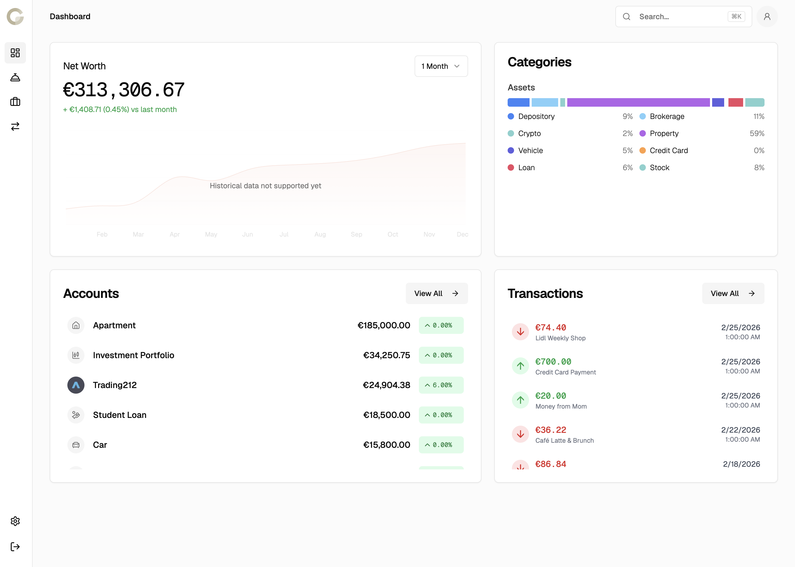

<p align="center">
  
</p>

<h1 align="center">Guilders</h1>

<p align="center">
  <a href="https://github.com/alinalihassan/Guilders/blob/main/package.json"></a>
  <a href="https://github.com/alinalihassan/Guilders/blob/main/LICENSE"></a>
</p>

<p align="center">
  Open-source, self-hostable personal finance platform.<br/>
  Track everything — bank accounts, investments, crypto, property — in one place.
</p>

<p align="center">
  <a href="https://guilders.app">Website</a> ·
  <a href="https://dashboard.guilders.app">Dashboard</a> ·
  <a href="https://docs.guilders.app">Docs</a> ·
  <a href="https://api.guilders.app/openapi">API</a>
</p>

---

<p align="center">
  
</p>

> [!WARNING]
> This project is very early in the development phase. Updates may not be backward compatible with previous versions, and you may not be able to migrate your data.
>
> **Focus and polish:** The most polished parts are the **API** and **Dashboard**, followed by **Websute** and **Docs**. The **mobile app** is not currently in focus and may be rebuilt from scratch.

## About

Guilders gives you a complete picture of your finances — bank accounts, investments, crypto, property, and more — in a single dashboard. It's fully open-source, privacy-first, and built for Europe and other markets where personal finance tools are limited. Connect banks automatically via open banking, add manual accounts for anything else, chat with an AI advisor, or build your own integrations with the open API and MCP support.

Use the hosted version at [guilders.app](https://guilders.app) or self-host the entire stack. See [docs.guilders.app](https://docs.guilders.app) for the full documentation.

## Features

- **Unified net worth** — Assets and liabilities across bank accounts, brokerages, crypto wallets, property, vehicles, credit cards, and loans
- **Automatic syncing** — Connect institutions via SaltEdge (open banking) and SnapTrade (brokerages), with more providers on the way
- **Manual accounts** — Track anything that doesn't have an API: cash, collectibles, real estate
- **Transaction tracking** — Categorize spending with hierarchical, customizable categories
- **Multi-currency** — Native support for any ISO currency with automatic exchange rate updates
- **AI financial advisor** — Chat with an AI that understands your full financial picture
- **MCP server** — Let AI agents (Claude, Cursor, etc.) access or make changes to your financial data
- **Open API** — Full REST API with OpenAPI docs, API key auth, and end-to-end type safety

## Getting Started

### Prerequisites

- [Bun](https://bun.sh) >= 1.3.9
- [PostgreSQL](https://www.postgresql.org/) (or a [Neon](https://neon.tech) database)

### Setup

```bash
git clone https://github.com/alinalihassan/Guilders.git
cd Guilders
bun install

cp apps/api/.env.example apps/api/.env
# Edit apps/api/.env with your database URL and secrets
```

### Run locally

```bash
# API → http://localhost:3000
cd apps/api && bun run dev

# Dashboard → http://localhost:3002
cd apps/dashboard && bun run dev

# Mobile (scan QR with Expo Go)
cd apps/mobile && bun run start
```

### Database Migrations

```bash
cd apps/api
bun db:migrate && bun db:init
```

## API

The API is fully documented via OpenAPI and supports two authentication methods:

| Method       | Header                          | Use case                                 |
| ------------ | ------------------------------- | ---------------------------------------- |
| Bearer token | `Authorization: Bearer <token>` | Dashboard and mobile app                 |
| API key      | `x-api-key: <key>`              | Scripts, integrations, third-party tools |

Generate an API key from the dashboard settings and start making requests:

```bash
curl https://api.guilders.app/api/account \
  -H "x-api-key: your-api-key"
```

Full reference and more examples at [docs.guilders.app](https://docs.guilders.app) · [OpenAPI spec](https://api.guilders.app/api/openapi).

## MCP (Model Context Protocol)

Guilders exposes an MCP server so AI agents can access your financial data with your permission. Connect it to Claude, Cursor, or any MCP-compatible client.

**Endpoint:** `https://api.guilders.app/mcp`

Authenticates via OAuth — your AI agent requests access and you approve it through the dashboard.

## Build Your Own Integrations

The open API means you can extend Guilders however you like:

- **Custom bank scrapers** — Push accounts and transactions on a schedule
- **Crypto wallet sync** — Read on-chain balances and post them via the API
- **CSV import** — Map statement rows to the transaction format

If your bank or broker isn't supported, build a connector that calls the Guilders API to keep your data up to date. See [docs.guilders.app](https://docs.guilders.app) for guides.

## Contributing

Contributions are welcome: bug fixes, provider integrations, features, and docs.

## License

See [`LICENSE`](LICENSE) for details.
