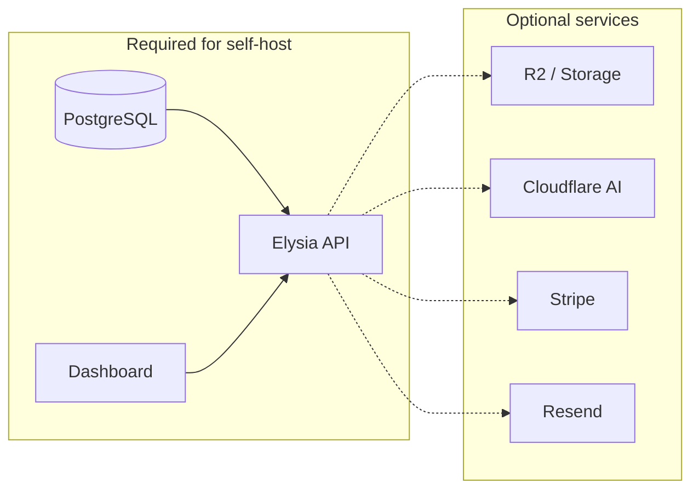

# Roadmap, Feature Priorities, and Self-Hosting Improvements

## 1. Ten features to implement (excluding mobile and Data Model Roadmap)

These are product/API/docs improvements not already in the roadmap and not mobile-specific:

| #   | Feature                                           | Rationale                                                                                                                                                                                                                                                                                                                 |
| --- | ------------------------------------------------- | ------------------------------------------------------------------------------------------------------------------------------------------------------------------------------------------------------------------------------------------------------------------------------------------------------------------------- |
| 1   | **CSV / bulk transaction import**                 | README and docs mention “CSV import” as a build-it-yourself integration; first-class import (with column mapping and category matching) would make onboarding and manual banks much easier.                                                                                                                               |
| 3   | **API health / readiness endpoint**               | e.g. `GET /health` or `GET /ready` that checks DB (and optionally optional services). Essential for self-hosted deployments, Docker, and orchestrators.                                                                                                                                                                   |
| 4   | **Spending-by-category report (API + dashboard)** | Aggregation API (e.g. by category and date range) and a dedicated “Spending by category” report page. You already have categories and Sankey; a clear report view and API would complete the story.                                                                                                                       |
| 6   | **User-facing webhooks**                          | Let users register a webhook URL; send events (e.g. new transaction, connection broken, balance threshold). Powers integrations and self-hosted automation without MCP.                                                                                                                                                   |
| 7   | **Graceful degradation for optional services**    | Make AI chat and document storage work when Cloudflare AI or R2 are missing: e.g. return 503 or a clear “feature disabled” for chat; document upload disabled or local/minimal storage fallback. Reduces required env vars for minimal self-hosting.                                                                      |
| 8   | **Rate limiting (API)**                           | Per-API-key and per-IP limits on public endpoints to protect self-hosted instances and avoid abuse.                                                                                                                                                                                                                       |
| 9   | **Backup / restore story**                        | Documented approach (e.g. `pg_dump` + R2/bucket backup) and optionally a `db:reset` script (as referenced in [docker-compose.yml](docker-compose.yml)) for local/dev.                                                                                                                                                     |
| 10  | **Docs: self-hosting runbook**                    | Single “Self-hosting” doc that covers: minimal vs full env (what’s required vs optional), Docker (Postgres + optional full stack), env files for API + dashboard, migrations, and troubleshooting. Currently [apps/docs/content/docs/self-hosting.mdx](apps/docs/content/docs/self-hosting.mdx) is docs-app–focused only. |

---

## 3. Immediate improvements to make self-hosting as easy as possible

Focus: reduce friction for someone running API + dashboard + Postgres on their own infra (including Docker).

### 3.1 Documentation and env clarity

- **Expand [apps/docs/content/docs/self-hosting.mdx](apps/docs/content/docs/self-hosting.mdx)** into a real self-hosting guide:
  - **Required:** `DATABASE_URL`, `BACKEND_URL`, `DASHBOARD_URL`, `GUILDERS_SECRET`, `BETTER_AUTH_SECRET`.
  - **Optional (with behaviour when unset):** Stripe, Resend, Cloudflare (AI, R2, Queues), SaltEdge, SnapTrade, EnableBanking, Teller, Ngrok.
  - Step-by-step: clone → install → copy env → run Postgres (e.g. `docker compose up -d`) → migrate + init → run API (e.g. `wrangler dev` or production deploy) → run dashboard with correct `NEXT_PUBLIC_*` URLs.
- **README [README.md](README.md):** Add a “Self-hosting” subsection that points to the docs and lists the **minimum** env vars (and that Cloudflare Workers + R2 + Queues are the current production target; link to Cloudflare deploy docs if they exist).
- **Dashboard env:** Ensure [apps/dashboard/.env.example](apps/dashboard/.env.example) is referenced in README and in the self-hosting doc so deployers know they need both API and dashboard env files.

### 3.2 API: health check and optional services

- **Add `GET /api/health` or `GET /health`** that:
  - Returns 200 and optionally `{ db: "ok" }` if the database is reachable.
  - Does not require auth. This allows load balancers and Docker healthchecks to verify the API.
- **Chat when AI is disabled:** If `CLOUDFLARE_AI_GATEWAY` (or equivalent) is missing, return a clear 503 or JSON error (“AI advisor not configured”) instead of failing at runtime, and document this in the self-hosting guide.
- **Documents when R2 is missing:** Document that document upload/download requires R2 (or equivalent binding). If possible, fail uploads with a clear “storage not configured” message when the binding is absent (depending on how Workers env is passed).

### 3.3 One-command local experience

- **Single-command “run everything” for local dev:** e.g. root script or `bun run dev` that starts Postgres (docker compose), runs migrations + init, then starts API and dashboard (or document the exact order in README and self-hosting doc).
- **Add `db:reset`** in [apps/api/package.json](apps/api/package.json) (e.g. migrate + drop/init or similar) so the docker-compose comment “bun run db:reset” is valid and new contributors can reset DB in one step.

### 3.4 Env and config files

- **API [apps/api/.env.example](apps/api/.env.example):** Add short comments for each group (required vs optional) and add any missing vars from [worker-configuration.d.ts](apps/api/worker-configuration.d.ts) (e.g. EnableBanking, Teller) so self-hosters see a single source of truth.
- **CORS:** Document that for self-hosting, deployers may need to add their dashboard origin to CORS; if there’s a single config (e.g. in [apps/api/src/app.ts](apps/api/src/app.ts)), note how to set it via env for self-hosted domains.

### 3.5 Summary diagram (optional for the doc)

---

## Summary

- **Next roadmap feature:** Implement **Merchants** (table, FK on transaction, API, optional UI).
- **10 extra features:** CSV import, data export, health endpoint, spending-by-category report, recurring transactions, user webhooks, optional-service degradation, rate limiting, backup/restore + `db:reset`, and a full self-hosting runbook in docs.
- **Immediate self-hosting improvements:** Expand self-hosting doc (required vs optional env, step-by-step), add health endpoint, graceful behaviour when AI/R2 are unset, document CORS, add `db:reset`, reference dashboard `.env.example`, and optionally a single-command local dev flow.
